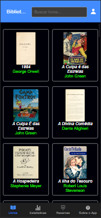

# Gerenciamento de Biblioteca
Este é um sistema simples para gerenciar uma biblioteca, incluindo funcionalidades para adicionar, remover e pesquisar livros.

## Uso
Para começar, basta clicar na página do livro correspondente. Você poderá verificar a disponibilidade e obter mais informações navegando entre as telas.

## Contribuição
Fique à vontade para contribuir a qualquer momento. Basta fazer um pull request.

## Documentação Adicional
**Sobre as imagens:** Neste projeto, utilizamos apenas imagens de domínio público.
**Informações dos livros:** As fichas técnicas são inspiradas em bibliotecas de domínio público.

[Link para o Trello](https://trello.com/c/uBAh418u/1-criar-o-esqueleto-inicial-do-projeto) - Acompanhe o desenvolvimento pelo Trello.

# Telas APP
## Telas Iphone
 
## Telas Android

## Histórico de Mudanças (Changelog)
- O projeto, que antes era para leitura de livros, agora é destinado para fazer reservas de livros.
- Agora é possível buscar livros na página inicial.

## Licença
MIT

## Autor(es)
Jefferson Lopes 